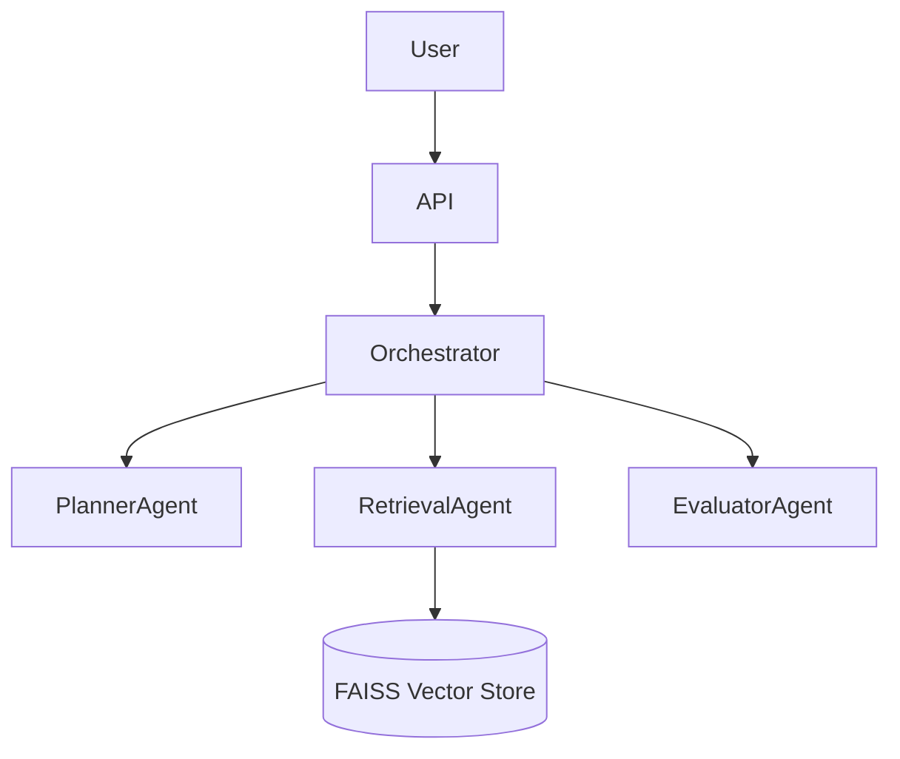

# Multi-Agent Clinical Document Assistant

## Project Overview
A portfolio-ready multi-agent Retrieval-Augmented Generation (RAG) project designed to answer healthcare questions from synthetic EHR data and clinical notes. The system utilizes three core agents (Planner, Retrieval, Evaluator) to ensure robust and grounded responses.

## Privacy Note
**All EHR data used and generated in this project is 100% synthetic.** No real patient data or Protected Health Information (PHI) is included.

## Architecture Diagram


## Folder Structure
```
Multi_Agents_Clinical_Rag/
├── app/
│   ├── planner_agent.py
│   ├── retrieval_agent.py
│   ├── evaluator_agent.py
│   ├── orchestrator.py
│   ├── ingest.py
│   └── api.py
├── data/
│   └── (Synthetic CSVs and FAISS Index)
├── streamlit_app.py
├── requirements.txt
└── README.md
```

## Setup Steps
1. Install dependencies: `pip install -r requirements.txt`
2. Run the ingestion script to (re)build the FAISS index from the CSVs in `data/`: `python -m app.ingest`
3. Start the API: `uvicorn app.api:app --reload`, or launch the UI: `streamlit run streamlit_app.py`

## Example API Request/Response
**POST /ask**
```json
{
  "query": "What are the active medications for patient P0001?"
}
```
**Response**
```json
{
  "query": "What are the active medications for patient P0001?",
  "answer": "Based on the retrieved clinical records:...",
  "grounded": true,
  "sources": [...],
  "evaluation": {
    "issues": [],
    "suggested_retry": false
  }
}
```

## Sample Questions
- What factors suggest the patient is high risk for 30-day readmission?
- Summarize the diabetic patient's recent history and possible follow-up concerns.
- Did patient P0010 have any abnormal lab results recently?

## Limitations
- The current planner and evaluator use heuristics instead of an actual LLM to allow for lightweight, offline testing in Colab.
- Simple embedding models (`all-MiniLM-L6-v2`) are used for speed.

## Future Improvements
- Integrate LangGraph/LangChain with an actual LLM (e.g., OpenAI or Llama 3) for the Planner and Evaluator agents.
- Add a dedicated re-ranking model for better retrieval accuracy.
